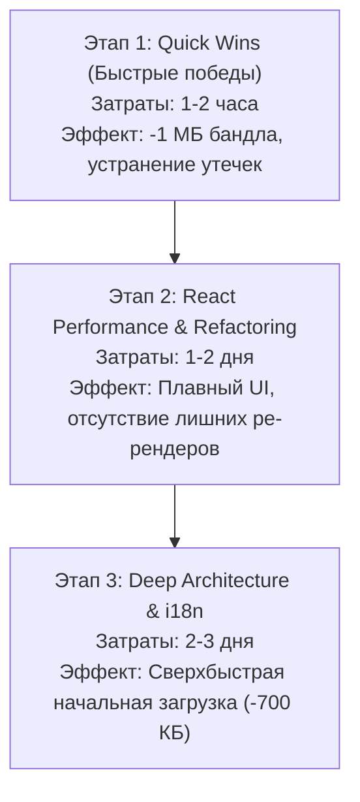

# Комплексный аудит оптимизации фронтенда «Хроники Края 2.0»

> **Статус документа:** Аналитический отчет и рекомендации  
> **Область анализа:** Клиентская часть (React 18, Vite 5, TypeScript, Sass, Zustand, SWR)  
> **Принцип:** Никаких правок в исходный код не вносилось (режим чистого аудита).

---

## Содержание
1. [Резюме и ключевые метрики](#1-резюме-и-ключевые-метрики)
2. [Категория 1: Сборка, бандл и разделение кода (Bundle Size & Code Splitting)](#2-категория-1-сборка-бандл-и-разделение-кода)
3. [Категория 2: Интернационализация (i18n) и бандлинг локалей](#3-категория-2-интернационализация-i18n-и-бандлинг-локалей)
4. [Категория 3: Производительность React и избыточные ре-рендеры](#4-категория-3-производительность-react-и-избыточные-ре-рендеры)
5. [Категория 4: Утечки памяти (Memory Leaks)](#5-категория-4-утечки-памяти-memory-leaks)
6. [Категория 5: Сетевые запросы, кэширование и медиа-ресурсы](#6-категория-5-сетевые-запросы-кэширование-и-медиа-ресурсы)
7. [Категория 6: Архитектурные монолиты («God-компоненты»)](#7-категория-6-архитектурные-монолиты-god-компоненты)
8. [Категория 7: Качество кода, TypeScript и ESLint](#8-категория-7-качество-кода-typescript-и-eslint)
9. [Категория 8: SEO, доступность (a11y) и отказоустойчивость](#9-категория-8-seo-доступность-a11y-и-отказоустойчивость)
10. [Матрица приоритетов и дорожная карта (Roadmap)](#10-матрица-приоритетов-и-дорожная-карта-roadmap)

---

## 1. Резюме и ключевые метрики

В ходе глубокого анализа фронтенд-кодовой базы проекта были выявлены ключевые узкие места, напрямую влияющие на скорость начальной загрузки (FCP, LCP), время отклика интерфейса (INP, TTI), сетевой трафик и потребление памяти.

### Текущее состояние сборки (`dist/assets`):
- **Суммарный объем JS в проде:** `~2.8 МБ` (до сжатия) / `~850 КБ` (Gzip).
- **Сверхтяжелые чанки:**
  - `index-C91HfTLd.js`: **902 КБ** (содержит монолит страниц экономики, `jspdf`, `html2canvas`, `lightweight-charts`, `lucide-react`).
  - `index-C1NitFnO.js`: **703 КБ** (монолит страниц государств и поселений).
- **Суммарный объем JSON-локалей в главном бандле:** **828 КБ** (все 75 JSON-файлов для 5 языков загружаются синхронно при старте).
- **Объем неоптимизированных картинок в `public/png`:** **2.6 МБ** (тяжелые несжатые PNG по 300–450 КБ).
- **Мертвый код:** В зависимостях присутствуют тяжелые библиотеки (`recharts`, `date-fns`), которые вообще не импортируются в проекте.
- **Утечки памяти:** Найдены неустранимые утечки в компонентах графиков (`TradingChart`, `MiniHistoryChart`), где экземпляры графиков не уничтожаются при размонтировании.

> [!TIP]
> **Потенциал оптимизации:**
> - Сокращение начального бандла: на **60–75%** (с ~2.8 МБ до ~700–900 КБ).
> - Устранение лишнего сетевого трафика картинок: на **80%** (перевод PNG в WebP/AVIF, удаление `Date.now()` кэш-бастинга).
> - Полное устранение утечек памяти в графиках биржи и валют.

---

## 2. Категория 1: Сборка, бандл и разделение кода

### 1.1. Разрушение Code Splitting из-за Barrel-файлов (`index.ts`) в `React.lazy()`
- **Файлы:**
  - [`src/App.tsx#L26-L34`](file:///Users/oleksandrshtonda/projects/minecraft-website/frontend/src/App.tsx#L26-L34)
  - [`src/modules/states/index.ts`](file:///Users/oleksandrshtonda/projects/minecraft-website/frontend/src/modules/states/index.ts)
  - [`src/modules/economy/index.ts`](file:///Users/oleksandrshtonda/projects/minecraft-website/frontend/src/modules/economy/index.ts)
- **Суть проблемы:**
  В [App.tsx](file:///Users/oleksandrshtonda/projects/minecraft-website/frontend/src/App.tsx) страницы подгружаются лениво, но импортируются через реэкспорты модулей (barrel files):
  ```tsx
  // Антипаттерн: импорт через индекс модуля
  const StatesListPage = React.lazy(() => import("./modules/states").then(m => ({ default: m.StatesListPage })));
  const StateDetailPage = React.lazy(() => import("./modules/states").then(m => ({ default: m.StateDetailPage })));
  const EconomyHubPage = React.lazy(() => import("./modules/economy").then(m => ({ default: m.EconomyHubPage })));
  ```
  Поскольку `modules/states/index.ts` реэкспортирует абсолютно все страницы, модалки и сервисы модуля, Rollup объединяет **весь модуль государств** в один 703 КБ чанк, а **весь модуль экономики** — в один 902 КБ чанк. Ленивая загрузка отдельных маршрутов фактически перестает работать: посетив `/states`, пользователь скачивает код национального банка, всех поселений, модалок создания и выборов.
- **Решение:**
  Импортировать страницы напрямую из их собственных файлов:
  ```tsx
  const StatesListPage = React.lazy(() => import("./modules/states/pages/states-list-page/states-list.page"));
  const StateDetailPage = React.lazy(() => import("./modules/states/pages/state-detail-page/state-detail.page"));
  const EconomyHubPage = React.lazy(() => import("./modules/economy/pages/EconomyHubPage"));
  ```

---

### 1.2. Синхронный импорт сверхтяжелых библиотек генерации PDF
- **Файл:**
  [`src/modules/economy/components/transaction-receipt-modal/transaction-receipt.modal.tsx#L4-L5`](file:///Users/oleksandrshtonda/projects/minecraft-website/frontend/src/modules/economy/components/transaction-receipt-modal/transaction-receipt.modal.tsx#L4-L5)
- **Суть проблемы:**
  ```tsx
  import html2canvas from 'html2canvas';
  import { jsPDF } from 'jspdf';
  ```
  `jsPDF` (~350–400 КБ) и `html2canvas` (~200 КБ) импортируются статически на верхнем уровне модального окна чека. Так как чек транзакции связан с экономикой, эти 600 КБ немедленно вшиваются в общий чанк экономики `index-C91HfTLd.js`. При этом 99% пользователей даже не открывают этот модал, а кнопка «Скачать PDF» нажимается еще реже.
- **Решение:**
  Перенести импорт библиотек внутрь обработчика клика `handleDownloadPdf`:
  ```tsx
  const handleDownloadPdf = async () => {
    setIsGenerating(true);
    try {
      const [{ default: html2canvas }, { jsPDF }] = await Promise.all([
        import('html2canvas'),
        import('jspdf')
      ]);
      // генерация PDF...
    } finally {
      setIsGenerating(false);
    }
  };
  ```
  Это мгновенно уберет **~600 КБ** из чанка экономики.

---

### 1.3. Мертвые зависимости в `package.json`
- **Файл:** [`package.json`](file:///Users/oleksandrshtonda/projects/minecraft-website/frontend/package.json)
- **Суть проблемы:**
  1. `"recharts": "^3.10.1"` — установлена тяжелая библиотека графиков (вместе с пакетами d3), но в проекте **0 импортов** `recharts` (все графики работают на `lightweight-charts`).
  2. `"date-fns": "^4.4.0"` — установлена библиотека работы с датами, но в кодовой базе **0 импортов** `date-fns` (все даты форматируются через нативный JS `Date`).
- **Решение:**
  Выполнить удаление неиспользуемых пакетов:
  ```bash
  npm uninstall recharts date-fns
  ```
  Это уменьшит `node_modules`, ускорит установку зависимостей в CI/CD и устранит риск случайного импорта дублирующих библиотек.

---

### 1.4. Отсутствие разделения вендорных библиотек в `vite.config.ts`
- **Файл:** [`vite.config.ts`](file:///Users/oleksandrshtonda/projects/minecraft-website/frontend/vite.config.ts)
- **Суть проблемы:**
  В конфигурации Vite не настроен `build.rollupOptions.output.manualChunks`. В результате тяжелые вендоры (`lightweight-charts`, `lucide-react`, `zustand`, `react-router`) перемешиваются с кодом компонентов и пересобираются/инвалидируются в браузере при каждом изменении любого UI-компонента.
- **Решение:**
  Настроить стратегию вендорных чанков:
  ```ts
  build: {
    rollupOptions: {
      output: {
        manualChunks: {
          'vendor-react': ['react', 'react-dom', 'react-router', 'react-router-dom'],
          'vendor-charts': ['lightweight-charts'],
          'vendor-ui': ['lucide-react', 'react-spinners', 'classnames'],
          'vendor-state': ['zustand', 'swr', 'axios'],
        }
      }
    }
  }
  ```
  Это обеспечит долгосрочное кэширование вендорных скриптов в браузере клиента (`HTTP 304 / Cache-Control: immutable`).

---

### 1.5. Предупреждение Sass о Legacy JS API
- **Суть проблемы:**
  При каждой сборке `npm run build` выводится 20+ строк предупреждений:
  `Deprecation [legacy-js-api]: The legacy JS API is deprecated and will be removed in Dart Sass 2.0.0.`
- **Решение:**
  В `vite.config.ts` включить современный компилятор Sass:
  ```ts
  css: {
    preprocessorOptions: {
      scss: {
        api: 'modern-compiler'
      }
    }
  }
  ```
  Это ускоряет сборку стилей благодаря пакету `sass-embedded` и убирает шум в логах CI.

---

## 3. Категория 2: Интернационализация (i18n) и бандлинг локалей

### 2.1. Монолитная синхронная загрузка всех переводов (828 КБ)
- **Файлы:**
  - [`src/i18n/i18n.ts`](file:///Users/oleksandrshtonda/projects/minecraft-website/frontend/src/i18n/i18n.ts)
  - Каталог `src/i18n/locales/` (5 языков × 15 неймспейсов = 75 JSON-файлов)
- **Суть проблемы:**
  В файле `i18n.ts` статически импортируются все 75 JSON-файлов для языков `ru`, `en`, `pl`, `ua`, `kz`.
  Файл `main.tsx` импортирует `i18n.ts` при старте приложения:
  `import "./i18n/i18n";`
  В итоге:
  - Русскоязычный пользователь, открыв лендинг, вынужден скачать и распарсить в память браузера весь польский, казахский, украинский и английский текст для административной панели, налогов, биржи и регламентов.
  - Общий объем несжатых JSON-переводов составляет **828 КБ**.
- **Решение:**
  Использовать динамическую подгрузку локалей через `i18next-resources-to-backend` или кастомный бэкенд с `import()`:
  ```ts
  import i18n from 'i18next';
  import resourcesToBackend from 'i18next-resources-to-backend';

  i18n
    .use(resourcesToBackend((language: string, namespace: string) => 
      import(`./locales/${language}/${namespace}.json`)
    ))
    .use(initReactI18next)
    .init({ ... });
  ```
  **Результат:** Начальный бандл мгновенно уменьшается на **~700+ КБ**. Браузер запрашивает только нужный язык и только нужные разделы.

---

## 4. Категория 3: Производительность React и избыточные ре-рендеры

### 4.1. Глобальная подписка на весь Zustand-стор (`useAuthStore`)
- **Файлы (21 компонент):**
  - [`src/modules/states/pages/states-list-page/states-list.page.tsx#L30`](file:///Users/oleksandrshtonda/projects/minecraft-website/frontend/src/modules/states/pages/states-list-page/states-list.page.tsx#L30)
  - [`src/modules/economy/pages/CompaniesListPage.tsx#L22`](file:///Users/oleksandrshtonda/projects/minecraft-website/frontend/src/modules/economy/pages/CompaniesListPage.tsx#L22)
  - [`src/shared/components/global-toast/GlobalToastProvider.tsx#L17`](file:///Users/oleksandrshtonda/projects/minecraft-website/frontend/src/shared/components/global-toast/GlobalToastProvider.tsx#L17)
  - [`src/modules/profile/pages/profile.page.tsx#L18`](file:///Users/oleksandrshtonda/projects/minecraft-website/frontend/src/modules/profile/pages/profile.page.tsx#L18)
  - И многие другие.
- **Суть проблемы:**
  Компоненты вызывают Zustand без селектора:
  ```tsx
  // Антипаттерн: подписка на весь объект стора
  const { isAuthenticated, isAdmin } = useAuthStore();
  ```
  В Zustand v5 вызов `useAuthStore()` без селектора подписывает компонент на **любое** изменение в сторе (обновление токена, смена бан-статуса, обновление роли, изменение `isEconomist`). В результате один фоновый запрос авторизации вызывает волну ре-рендеров по всему дереву компонентов.
- **Решение:**
  Использовать точечные селекторы либо `useShallow`:
  ```tsx
  // Вариант 1: атомарный селектор
  const isAuthenticated = useAuthStore(state => state.isAuthenticated);

  // Вариант 2: useShallow для нескольких полей
  import { useShallow } from 'zustand/react/shallow';
  const { isAuthenticated, isAdmin } = useAuthStore(
    useShallow(state => ({ isAuthenticated: state.isAuthenticated, isAdmin: state.isAdmin }))
  );
  ```

---

### 4.2. Дорогие вычисления без `useMemo` в циклах рендера
- **Пример 1 — [`players.page.tsx#L53-L67`](file:///Users/oleksandrshtonda/projects/minecraft-website/frontend/src/modules/players/pages/players.page.tsx#L53-L67):**
  ```tsx
  const filteredUsers = users.filter((user) => {
    const matchesOnline =
      filterOnline === "all" ||
      (filterOnline === "online" && onlinePlayers.players.includes(user.username)); // O(N * M)
    // ...
  });
  ```
  Массив `users` фильтруется при каждом ре-рендере без `useMemo`. Поиск в массиве `onlinePlayers.players.includes()` дает квадратичную сложность.
  *Решение:* Обернуть в `useMemo` и преобразовать `onlinePlayers.players` в `new Set(...)` для проверки за $O(1)$.

- **Пример 2 — [`achievements-admin.page.tsx#L25-L29`](file:///Users/oleksandrshtonda/projects/minecraft-website/frontend/src/modules/admin/pages/achievements-admin.page.tsx#L25-L29):**
  ```tsx
  const sortedAchievements = [...(achievements || [])].sort((a, b) => ...);
  ```
  Сортировка массива достижений выполняется на каждый ввод символа в любое поле формы (заголовок, описание, иконка).
  *Решение:* Обернуть в `useMemo(..., [achievements])`.

- **Пример 3 — [`useEconomyData.ts#L36-L49`](file:///Users/oleksandrshtonda/projects/minecraft-website/frontend/src/modules/economy/hooks/useEconomyData.ts#L36-L49):**
  В хуке `useMyCompanies` при каждом ре-рендере вызывается `JSON.parse(atob(accessToken.split('.')[1]))` без мемоизации.
  *Решение:* Парсить имя пользователя один раз при авторизации и сохранять в `auth.store` или мемоизировать.

---

### 4.3. Нестабильные ссылки на функции-пропсы (Triggering Loops & Re-fetches)
- **Файлы:**
  - [`src/modules/economy/components/MarketTab.tsx#L61`](file:///Users/oleksandrshtonda/projects/minecraft-website/frontend/src/modules/economy/components/MarketTab.tsx#L61)
  - [`src/modules/economy/pages/CurrencyDetailPage.tsx#L104`](file:///Users/oleksandrshtonda/projects/minecraft-website/frontend/src/modules/economy/pages/CurrencyDetailPage.tsx#L104)
- **Суть проблемы:**
  Родительские компоненты передают в `TradingChart` новую стрелочную функцию на каждый рендер:
  ```tsx
  <TradingChart fetchHistory={() => economyService.getCompanySharePriceHistory(selectedCompany.id)} />
  ```
  Внутри `TradingChart` функция `fetchHistory` добавлена в массив зависимостей `useEffect`:
  ```tsx
  useEffect(() => { loadData(); }, [fetchHistory, ...]);
  ```
  Поскольку ссылка `fetchHistory` новая на каждом рендере родителя, `loadData()` перезапускается повторно при любом обновлении стейта в родителе.
- **Решение:**
  Оборачивать коллбэки в `useCallback` в родителе, либо в `TradingChart` принимать `companyId` / `currencyId` вместо функции и вызывать нужный метод сервиса напрямую.

---

### 4.4. Прямые манипуляции с DOM в React-компонентах
- **Файл:** [`src/modules/economy/components/MinecraftItemSelector.tsx#L197-L206`](file:///Users/oleksandrshtonda/projects/minecraft-website/frontend/src/modules/economy/components/MinecraftItemSelector.tsx#L197-L206)
- **Суть проблемы:**
  Для элементов списка написаны обработчики `onMouseEnter` и `onMouseLeave`, которые вручную мутируют `e.currentTarget.style.backgroundColor = '#f1f5f9'`.
  Создаются сотни inline-объектов `style={{ ... }}` на каждый рендер списка предметов.
- **Решение:**
  Вынести стили в SCSS-класс со стандартным псевдоклассом `:hover`. Это разгрузит виртуальный DOM и JS-поток.

---

## 5. Категория 4: Утечки памяти (Memory Leaks)

### 5.1. Утечка инстансов графиков в `TradingChart` и `MiniHistoryChart`
- **Файлы:**
  - [`src/modules/economy/components/TradingChart.tsx#L110-L141`](file:///Users/oleksandrshtonda/projects/minecraft-website/frontend/src/modules/economy/components/TradingChart.tsx#L110-L141)
  - [`src/modules/economy/components/MiniHistoryChart.tsx#L117-L120`](file:///Users/oleksandrshtonda/projects/minecraft-website/frontend/src/modules/economy/components/MiniHistoryChart.tsx#L117-L120)
- **Суть проблемы:**
  Библиотека Lightweight Charts создает canvas-контексты, анимационные циклы `requestAnimationFrame` и DOM-структуры через `createChart()`.
  Официальная документация требует обязательно вызывать `chart.remove()` при размонтировании компонента.
  В текущем коде:
  ```tsx
  return () => {
    isMounted = false;
    // chartRef.current?.remove(); — ОТСУТСТВУЕТ!
  };
  ```
  В результате:
  - Каждый раз, когда пользователь переключает вкладки в экономике (Биржа ↔ Валюты ↔ Компании), старые инстансы графиков остаются висеть в памяти.
  - В `MiniHistoryChart` (который выводится в каждой карточке валюты и компании) при пагинации или фильтрации утекают десятки canvas-инстансов, приводя к нарастанию потребления RAM вкладкой браузера (вплоть до сотен мегабайт).
- **Решение:**
  Добавить обязательный вызов очистки:
  ```tsx
  useEffect(() => {
    return () => {
      if (chartRef.current) {
        chartRef.current.remove();
        chartRef.current = null;
      }
    };
  }, []);
  ```

---

### 5.2. Неконтролируемые таймеры в `GlobalToastProvider.tsx`
- **Файл:** [`src/shared/components/global-toast/GlobalToastProvider.tsx#L45-L47`](file:///Users/oleksandrshtonda/projects/minecraft-website/frontend/src/shared/components/global-toast/GlobalToastProvider.tsx#L45-L47)
- **Суть проблемы:**
  При получении SSE-события достижений запускается таймер удаления:
  ```tsx
  setTimeout(() => {
    setToasts((prev) => prev.filter((t) => t.id !== newToast.id));
  }, 10000);
  ```
  Таймеры не сохраняются в массиве идентификаторов и не очищаются при отмонтировании или смене пользователя.

---

## 6. Категория 5: Сетевые запросы, кэширование и медиа-ресурсы

### 6.1. Разрушение HTTP-кэша аватарок через `Date.now()`
- **Файлы:**
  - [`src/modules/players/pages/players.page.tsx#L121`](file:///Users/oleksandrshtonda/projects/minecraft-website/frontend/src/modules/players/pages/players.page.tsx#L121)
  - [`src/modules/profile/pages/profile.page.tsx#L156`](file:///Users/oleksandrshtonda/projects/minecraft-website/frontend/src/modules/profile/pages/profile.page.tsx#L156)
- **Суть проблемы:**
  ```tsx
  src={user?.avatar_img ? `${user.avatar_img}?t=${Date.now()}` : "/png/steve-head.png"}
  ```
  Вызов `Date.now()` вычисляется **в теле JSX при каждом ре-рендере**.
  При переключении любого фильтра или состояния страницы URL аватарки каждого игрока меняется на новый миллисекундный таймстемп. Браузер считает это совершенно новым ресурсом, инвалидирует кэш и отправляет повторные GET-запросы на сервер для всех аватарок.
- **Решение:**
  Удалить `?t=${Date.now()}` из рендера списков. Кэш-бастинг должен применяться **только** в момент загрузки нового аватара (например, через поле `user.updatedAt` или сохранение версии в стейте после загрузки).

---

### 6.2. Неоптимизированные растровые изображения и 404 ошибки
- **Суть проблемы:**
  1. **Тяжелые PNG:** В `public/png` лежат большие несжатые файлы: `city.png` (428 КБ), `party.png` (363 КБ), `train.png` (322 КБ), `zabka.png` (447 КБ). Конвертация в современный формат WebP/AVIF уменьшит их вес в 4–6 раз (до 50–70 КБ).
  2. **Отсутствие `loading="lazy"`:** На лендинге ([landing.page.tsx](file:///Users/oleksandrshtonda/projects/minecraft-website/frontend/src/modules/landing/landing.page.tsx)) и в списках игроков все картинки грузятся жадно (`eager`).
  3. **Отсутствие `width` и `height`:** Вызывает сдвиги макета при загрузке (ухудшает метрику CLS).
  4. **404 Not Found:**
     - В [`landing.page.tsx#L45`](file:///Users/oleksandrshtonda/projects/minecraft-website/frontend/src/modules/landing/landing.page.tsx#L45): указан ``, но такого файла в каталоге `public/png/` **нет**. Это приводит к лишнему 404 запросу и битому изображению на первом экране.
     - В [`index.html#L5`](file:///Users/oleksandrshtonda/projects/minecraft-website/frontend/index.html#L5): указан `<link rel="icon" href="/vite.svg" />`, но файла `vite.svg` в `public/` нет (404 ошибка при загрузке favicon).

---

### 6.3. Гонка запросов и отсутствие очереди при обновлении Refresh Token
- **Файл:** [`src/shared/services/main-axios.ts#L12-L41`](file:///Users/oleksandrshtonda/projects/minecraft-website/frontend/src/shared/services/main-axios.ts#L12-L41)
- **Суть проблемы:**
  Если при переходе на страницу одновременно отправляются 3–5 запросов (например, в `Promise.all([getMyCards(), getMyAccounts(), ...])`) и access-токен истек, все запросы одновременно получают статус 401.
  В интерцепторе отсутствует флаг блокировки / очередь ожидающих промисов (`isRefreshing` + `failedQueue`). В итоге отправляется сразу несколько параллельных POST-запросов на `/auth/refresh/`. При ротации refresh-токенов бэкенд аннулирует последующие запросы, что приводит к внезапному логауту пользователя.
- **Решение:**
  Реализовать стандартный паттерн очереди для Axios-интерцептора с ожиданием одного активного запроса на обновление токена.

---

### 6.4. Дублирование сетевых запросов и несогласованное использование SWR
- **Суть проблемы:**
  - В проекте есть хуки [`useMyCards`](file:///Users/oleksandrshtonda/projects/minecraft-website/frontend/src/modules/economy/hooks/useEconomyData.ts) и `useMyAccounts` на базе SWR с кэшированием. Однако страница [`CardsPage.tsx`](file:///Users/oleksandrshtonda/projects/minecraft-website/frontend/src/modules/economy/pages/CardsPage.tsx) игнорирует эти хуки и делает повторный ручной запрос через `economyService` с локальным лоадером.
  - Запрос `profileService.getInfoAboutMe()` дублируется в 4 разных страницах (`StateDetailPage`, `TechSupportPage`, `ProfilePage`, `PlayersPage`), вместо того чтобы брать профиль из кэша SWR ключа `'profile/me'` или единого селектора стора.

---

## 7. Категория 6: Архитектурные монолиты («God-компоненты»)

### 7.1. Монолитные компоненты страниц с десятками модалок внутри
В проекте сформировался ряд компонентов огромного размера:
- [`state-detail.page.tsx`](file:///Users/oleksandrshtonda/projects/minecraft-website/frontend/src/modules/states/pages/state-detail-page/state-detail.page.tsx): **1363 строки**
- [`PropertiesPage.tsx`](file:///Users/oleksandrshtonda/projects/minecraft-website/frontend/src/modules/economy/pages/PropertiesPage.tsx): **788 строк**
- [`StockExchangePage.tsx`](file:///Users/oleksandrshtonda/projects/minecraft-website/frontend/src/modules/economy/pages/StockExchangePage.tsx): **579 строк**
- [`settlement-detail.page.tsx`](file:///Users/oleksandrshtonda/projects/minecraft-website/frontend/src/modules/states/pages/settlement-detail-page/settlement-detail.page.tsx): **563 строки**
- [`CardsPage.tsx`](file:///Users/oleksandrshtonda/projects/minecraft-website/frontend/src/modules/economy/pages/CardsPage.tsx): **442 строки**

**Почему это влияет на производительность:**
Например, в `state-detail.page.tsx` прямо в теле страницы определены состояния для 7 различных модальных окон (создание поселения, смена типа, выпуск валюты, создание банка, налоги, роли, редактирование государства) — всего свыше 30 `useState` хуков.
Когда пользователь открывает модалку и вводит текст в поле названия поселения, **каждое нажатие клавиши** вызывает полный ре-рендер гигантской страницы со всеми ее списками граждан, декретов, казначейства и графиков.

**Решение:**
Вынести каждую модалку в отдельный независимый компонент (например, `CreateSettlementModal.tsx`, `CreateCurrencyModal.tsx`). Состояние полей формы должно инкапсулироваться внутри модалки, а страница должна передавать только флаг открытия и коллбэк `onSuccess`.

---

## 8. Категория 7: Качество кода, TypeScript и ESLint

### 8.1. 18 ошибок линтера и риски в `npm run lint`
- **Суть проблемы:**
  Запуск `npm run lint` завершается с ошибкой (`code 1`, 18 errors, 3 warnings).
  - 14 ошибок `Unexpected any. Specify a different type (@typescript-eslint/no-explicit-any)` в критичных модулях (`state-detail.page.tsx`, `PropertiesPage.tsx`, `achievements-admin.page.tsx`).
  - Неиспользуемые переменные ошибок (`no-unused-vars`).
  - Нарушения правил хуков (`react-hooks/exhaustive-deps`) в `DisputedOrdersTab.tsx`, `CurrenciesPage.tsx`, `PropertiesPage.tsx`. Пропуск зависимостей в `useEffect` грозит устаревшими замыканиями (stale closures), когда данные не обновляются после изменения фильтров или пропсов.

---

## 9. Категория 8: SEO, доступность (a11y) и отказоустойчивость

### 9.1. Отсутствие Error Boundary
- **Файл:** [`src/App.tsx`](file:///Users/oleksandrshtonda/projects/minecraft-website/frontend/src/App.tsx)
- **Суть проблемы:**
  В приложении с большим количеством динамических чанков (`React.lazy`) при сбое сети или выкатке новой версии на сервере (когда старые хэши чанков перестают существовать) пользователь получает `ChunkLoadError`. Без компонента `ErrorBoundary` всё дерево React размонтируется, оставляя пользователя на мертвом белом экране.
- **Решение:**
  Обернуть `<Routes>` в компонент `ErrorBoundary` с кнопкой «Перезагрузить страницу» и автоматической перезагрузкой при `ChunkLoadError`.

### 9.2. Доступность кликабельных карточек и SEO
- **Файлы:** [`src/modules/news/pages/news.page.tsx#L62-L66`](file:///Users/oleksandrshtonda/projects/minecraft-website/frontend/src/modules/news/pages/news.page.tsx#L62-L66) и др.
- **Суть проблемы:**
  Карточки новостей сделаны как `<article onClick={() => navigate(...)}>`.
  - Поисковые роботы не могут индексировать такие переходы, так как отсутствует тег `<a href="...">`.
  - Пользователи не могут открыть новость в новой вкладке через колесико мыши или `Ctrl+Click`.
  - Навигация недоступна для пользователей с клавиатурой (отсутствует фокус по Tab и активация по Enter).
- **Решение:**
  Использовать компонент `<Link to="...">` из `react-router-dom` вместо `div/article` с `onClick`.

### 9.3. Оптимизация шрифтов и `<head>`
- **Файлы:** [`index.html`](file:///Users/oleksandrshtonda/projects/minecraft-website/frontend/index.html), [`src/App.css`](file:///Users/oleksandrshtonda/projects/minecraft-website/frontend/src/App.css)
- **Рекомендации:**
  - Добавить `<link rel="preload" href="/src/assets/fonts/minencraft.woff2" as="font" type="font/woff2" crossorigin>` в `index.html` для устранения задержки отображения заголовков в пиксельном шрифте.
  - Заменить `<html lang="en">` на динамический или актуальный язык (`ru`).
  - Добавить мета-теги `description` и базовые OpenGraph теги (`og:title`, `og:image`).

---

## 10. Матрица приоритетов и дорожная карта (Roadmap)

Для достижения максимального эффекта при минимальных затратах времени оптимизацию рекомендуется разбить на 3 последовательных этапа:



| Приоритет | Задача | Файлы / Модули | Влияние на проект | Сложность |
| :--- | :--- | :--- | :--- | :--- |
| **P0 (Критично)** | **Устранить утечку памяти в графиках** (`chart.remove()`) | `TradingChart.tsx`, `MiniHistoryChart.tsx` | Предотвращение краша вкладки браузера и утечки RAM | Очень низкая (10 мин) |
| **P0 (Критично)** | **Ленивый импорт `jsPDF` и `html2canvas`** | `transaction-receipt.modal.tsx` | **-600 КБ** из чанка экономики | Очень низкая (15 мин) |
| **P0 (Критично)** | **Удалить неиспользуемые `recharts` и `date-fns`** | `package.json` | Очистка дерева зависимостей | Очень низкая (5 мин) |
| **P0 (Критично)** | **Удалить `Date.now()` из рендера аватарок** | `players.page.tsx`, `profile.page.tsx` | Восстановление HTTP-кэша, устранение спама картинок | Очень низкая (10 мин) |
| **P1 (Высокий)** | **Разделить страницы напрямую (минуя barrel `index.ts`)** | `App.tsx` | Дробление 900 КБ и 700 КБ чанков на маленькие маршруты | Низкая (30 мин) |
| **P1 (Высокий)** | **Настроить `manualChunks` и `modern-compiler`** | `vite.config.ts` | Кэширование вендоров, чистые логи сборки | Низкая (20 мин) |
| **P1 (Высокий)** | **Добавить селекторы в `useAuthStore`** | 21 компонент с `useAuthStore()` | Устранение каскадных ре-рендеров приложения | Средняя (1-2 часа) |
| **P1 (Высокий)** | **Исправить битые ссылки (settlement.png, favicon)** | `landing.page.tsx`, `index.html` | Устранение 404 ошибок при загрузке страниц | Низкая (15 мин) |
| **P1 (Высокий)** | **Добавить `ErrorBoundary`** | `App.tsx` | Защита от белого экрана при сетевых сбоях | Низкая (30 мин) |
| **P2 (Средний)** | **Декомпозиция модалок из `state-detail` и `Properties`** | `state-detail.page.tsx`, `PropertiesPage.tsx` | Ускорение отклика форм, чистота архитектуры | Средняя (1 день) |
| **P2 (Средний)** | **Перевод PNG-изображений в формат WebP** | `public/png/` | Сокращение веса картинок с 2.6 МБ до ~400 КБ | Средняя (1 час) |
| **P2 (Средний)** | **Очередь запросов в Axios-интерцепторе refresh-токена** | `main-axios.ts` | Стабильность сессии при истечении токена | Средняя (2 часа) |
| **P3 (Масштаб)** | **Динамическая загрузка переводов i18n по требованию** | `src/i18n/` | **-700+ КБ** из главного начального чанка | Средняя (1-2 дня) |
| **P3 (Масштаб)** | **Исправление 18 ошибок ESLint и типизация `any`** | `src/modules/...` | Надежность типов и предотвращение багов | Средняя (1 день) |

---
*Документ сформирован в режиме аудита согласно запросу пользователя.*
